# notes-for-turbo-coding-and-decoding
The note briefly explains how turbo coding and decoding works.

# Turbo coding

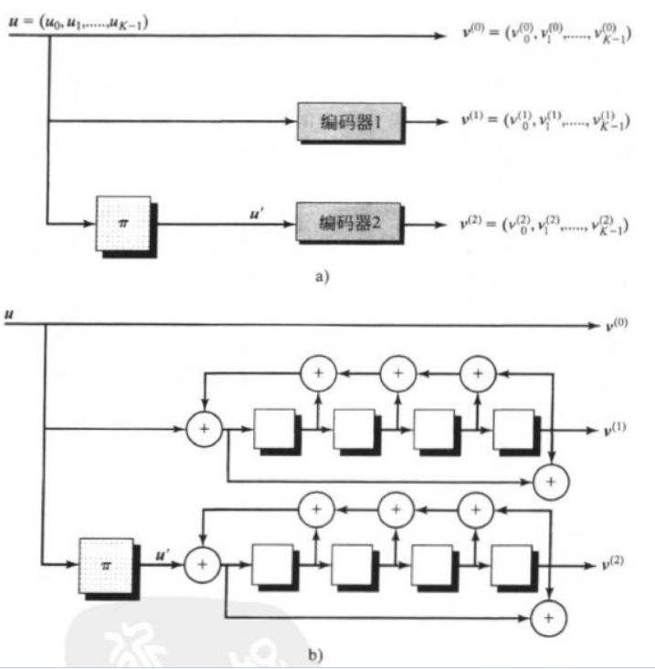

编码器形式如上，由两个并行的卷积码编码器构成，第一个编码器输出 ($\mathbf{v}^{(0)}$,$\mathbf{v}^{(1)}$) ，第二个编码器输出 ($\mathbf{v}^{(0)}$,$\mathbf{v}^{(2)}$) !!!! $\mathbf{v}^{(0)}=\mathbf{u}$ 是 信息序列,  $\mathbf{v}^{(1)}$ 和 $\mathbf{v}^{(2)}$ 叫 parity vector，$\pi$ 是交织器 interleaver，负责把输入信息打乱。

下面两个例子16.1 和 16.2 比较了 不带interleaver的普通卷积码,和带interleaver的卷积码 的重量谱区别, 体现了interleaver的作用

**EXAMPLE 16.1  Weight Spectrum of a Terminated Convolutional Code** 收尾卷积码的重量谱

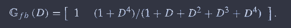

生成一个带 feedback的recursive convolutional code (2,1,4) 【2 应该是输出数量，1 应该是每组寄存器有几个小单元，4 是有几个寄存器】

$K^*$个输入信息符号，最后输入 $\nu=4$ (寄存器数量) 个符号使得寄存器状态 回到 0. 这等效于 block code分组码 $(N,K^*)$ 其中 $K=K^*+\nu$. 因为分组码就是 把一串信息分成很多个组,分别编码. 线性分组码才是要乘矩阵

这里 $K^*$ 取 $12$, $N=32$, 即 $ (32, 12)$

**EXAMPLE 16.2  Weight Spectrum of a Parallel Concatenated Code**

两个并行的卷积码$(32,12)$, 其中一个带了random interleaver, 映射规则是:

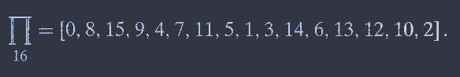

然后puncture , puncturing matrix: 后面有这个的含义

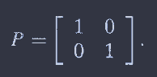

然后整体的卷积码: $(32,12)$

比较两种码的weight distribution, 就是每个权重的码字有多少, 权重的码字分布

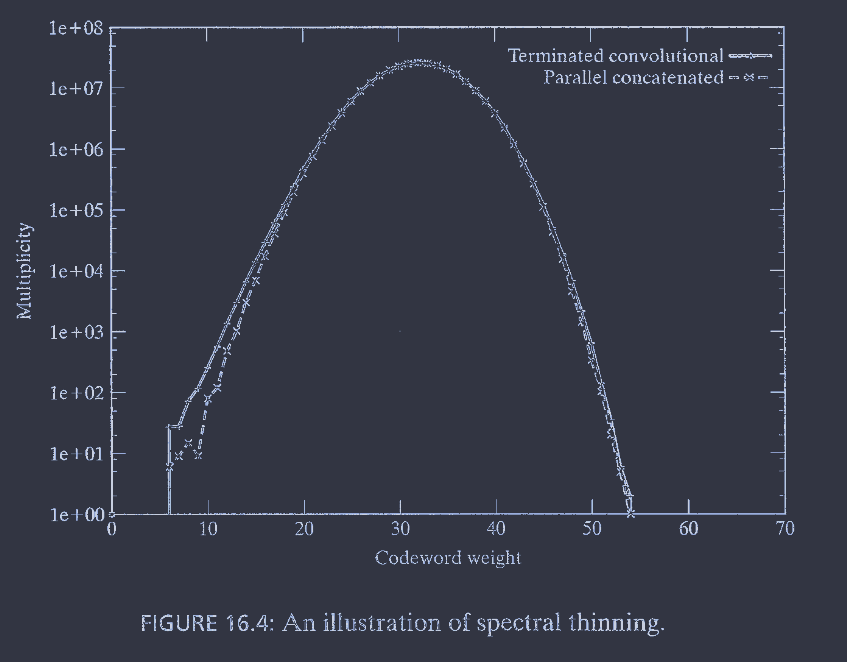

可以看出, 这种使用interleaver的并行卷积码编码器 输出的weight小的码字数量 更少, 更接近于 随机分布(二元分布 binomial distribution), 也就是说, interleaver 可以实现一种 伪随机 pseudorandom的性质, 把低 weight的码字变成 高 weight. 符合二元权重分布的编码可以实现 香农界, 这是香农提出的 random-coding proof of the noisy-channel coding theorem.

-------

学一下怎么读卷积码的punturing matrix

**Trellis**：

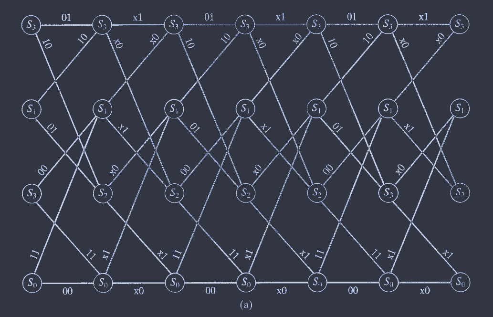

对应的puncturing matrix

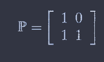

每几行表示第几个 输出的序列（$v^{(1)},v^{(2)}$)

列的数量表示删除元素的 周期，比如这个图的删除周期是 两个结点

【1 0】 表示第一个结点，第一个输出没有被删；第二个结点，第一个输出被删了

【11】表示第一和第二个结点的输出里，第二个输出都没被删

第二个例子同理

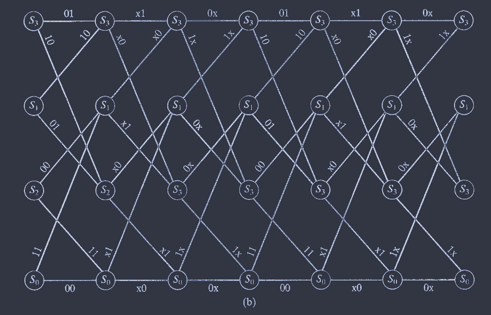

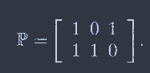

-------

# Turbo decoding

turbo译码的主要思想就是

外部信息 = 后验信息 - 内部信息 = 后验信息 - ( 信道信息 + 先验信息 )
$$
L_e(u_l)=L(u_l)-L_c\mathbf{r}^{(0)}-L_a(u_l)
$$
其中$L_c=\frac{4E_S}{N_0}$

每个编码器输入 先验信息$L_a(u_l)$ 和 观测值 $\mathbf{r}$ , 输出 后验信息 $L(u_l)$

 后验信息 $L(u_l)$ 减去 先验信息 $L_a(u_l)$ 和 信道信息 $L=L_c \mathbf{r}^{(0)}_l$ 得到 外部信息 $L_e(u_l)$

外部信息作为下一个编码器的 先验信息

**重点 **就是 外部信息 作为 先验信息

这里每一个decoder都是一个soft-input-soft-output MAP 解码器, 书里用的就是BJCR, 对于turbo equalization, 可能用的就是其他的形式

在error control decoding书里有详细的关于公式(1) 的推导, 给出了完整的形式

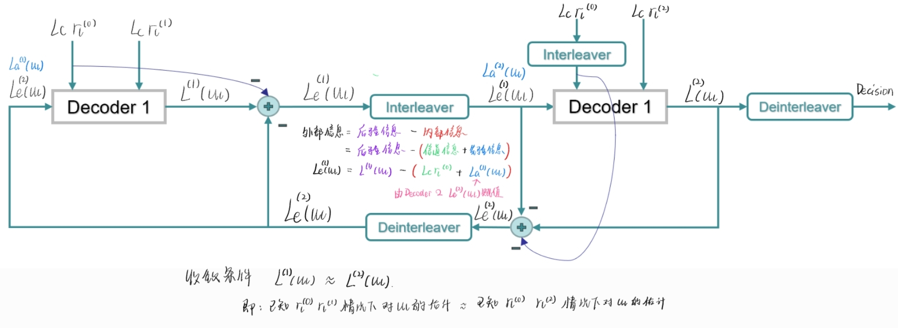

需要注意, 这里的 信道信息, 和parity vector的观测值 $\mathbf{r}^{(1)}$ 与 $\mathbf{r}^{(2)}$ 无关, 只和 信息序列 对应的观测值$\mathbf{r}^{(0)}$ 有关

收敛条件如图所示, 因为我们的后验信息LLR是
$$
L^{(1)}(u_l)=\log\frac{P(u=+1|\mathbf{r^{(0)}},\mathbf{r^{(1)}})}{P(u=-1|\mathbf{r^{(0)}},\mathbf{r^{(1)}})}
$$

$$
L^{(2)}(u_l)=\log\frac{P(u=+1|\mathbf{r^{(0)}},\mathbf{r^{(2)}})}{P(u=-1|\mathbf{r^{(0)}},\mathbf{r^{(2)}})}
$$

这里近似于对每个decoder分别做MAP, 当这两个值接近时,说明译码结果稳定,收敛

-----

turbo码的性能有两种分析方式, 1:均匀交织器分析 uniform interleaver 2.门限分析 threshold

均匀交织器考虑权重和$d_{free}$的分析, 用于高信噪比下的误码性能较好的情况, 计算十分复杂, 没看; 门限分析使用EXIT图, 用于中低信噪比的情况. 门限分析使用EXIT图, 说明了turbo decoding 的合理性

EXIT 全称是 extrinsic information transfer chart, 体现了 译码器输入互信息 $I\left(u_l;L_a\left(u_l\right)\right)$ 

与 输出互信息 $I_a\left[u_l;L_e\left(u_l\right)\right]$ 之间的关系

其中,互信息求解方法如下:(l变成i了,不是很重要)

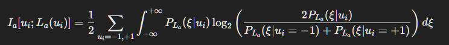

其中 $\xi$ 是$L_a(u_l)$, 这个是用互信息定义推的

由于
$$
L_e(u_l)=L(u_l)-L_c\mathbf{r}^{(0)}-L_a(u_l)
$$
其中 $\mathbf{r}^{(0)}=(\mathbf{v}^{(0)}+\mathbf{n})/\sqrt{E_s}$, 这意味着$\mathbf{r}^{0}$分布为 $\mathcal{N}(±1,\frac{N_0}{2Es})$ 信道信息 $L_c\mathbf{r}^{(0)}$ 的分布是均值为 $±L_c$, 方差为 $\frac{N_0}{2Es}L_c^2=2L_c$

在分组长度很大时, 外部信息的分布仿真结果说明, 我们可以将 先验信息建模为高斯分布 $\mathcal{N}(\sigma_a^2/2,\sigma_a^2)$
$$
P_{L_a}(\xi|u_l)=\frac{1}{\sqrt{2\pi\sigma_a^2}}e^{-(\xi-u_l\sigma_a^2/2)^2/2\sigma_a^2}
$$
确定了 $\sigma_a^2$ ,  就可以拟合这个高斯分布, 带入求得互信息 $I_a\left[u_l;L_e\left(u_l\right)\right]$ . 确定信噪比之后, 就可以通过译码器 获得输出的 后验信息分布 (只需要执行一次), 然后得到互信息  $I_e\left[u_l;L_e\left(u_l\right)\right]$, 这就是下图中的一个点, 有一个自变量: $\sigma_a^2 \rightarrow I_a$ ,  一个参数$E_b/N_0$ :  $I_a+E_b/N_0 \rightarrow I_e$

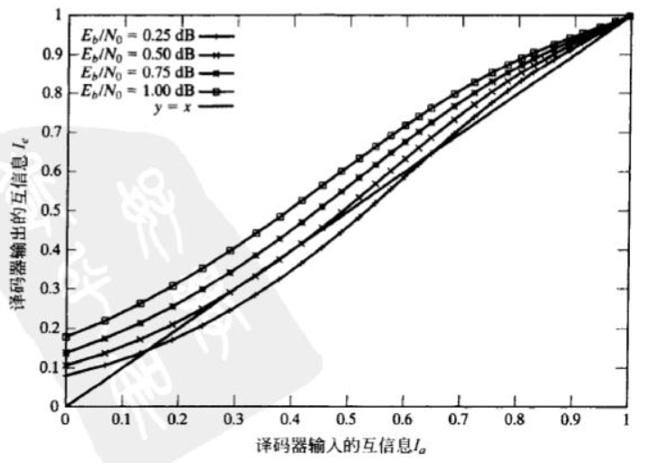

注意上图里有一个$y=x$ 的线, 在这条线之上就是 输出互信息 > 输入互信息, 说明这个编码器有效果, 可以提高我们对 $u_l$ 的认识, 否则 ( 在线之下 ) 恶化我们对 $u_l$ 的认识. 如图, 改变 SNR 可以改变线的位置, 最低的 那条高于 $y=x$ 的线 所对应的SNR 就是 SNR门限 SNR threshold.

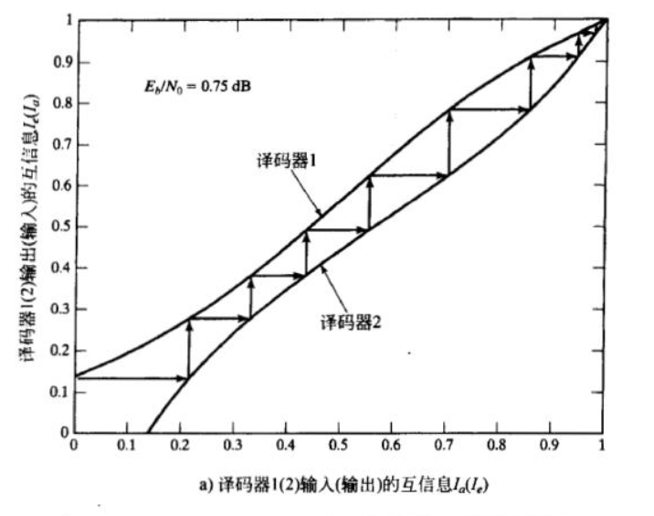

上图就是EXIT图, 画出了两个编码器的输入输出互信息图, 但是两个编码器的输入和输出位置相反,就是第二个编码器的横纵坐标交换了一下. 很有意思, 一开始输入译码器1的互信息是0, 输出就是纵坐标0.13的位置, 译码器1输出的互信息显然又作为译码器2输入的互信息, 然后纵坐标映射到横坐标, 可以得到译码器2输出的互信息, 作为译码器1输入的互信息, 周而复始地映射, 最后二者都达到最大值收敛.

这张图说明了为什么turbo译码会有效, 因为输出的互信息大于输入的互信息时,就可以不断增长对 $u_l$的认识, 这是从信息论的角度分析的

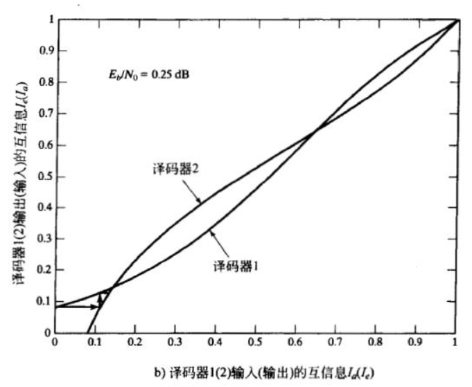

相反,如果这条线是低于$y=x$, 到某个位置互信息就无法通过译码器增长, 也就无法成功译码
